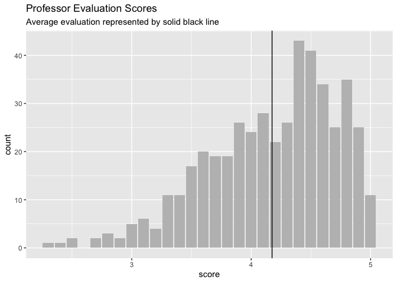
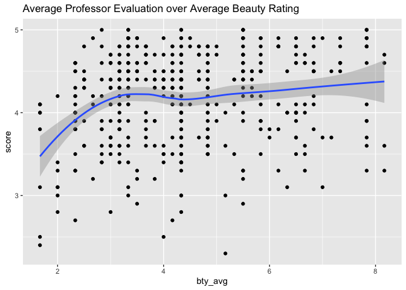
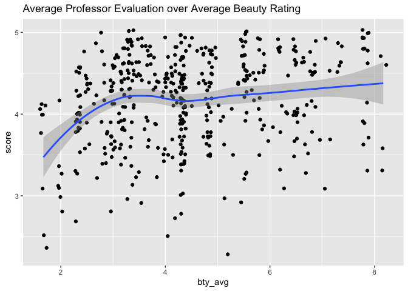
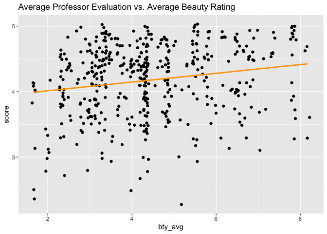

Lab 09 - Grading the professor, Pt. 1
================
Lindsey Wilson
4/24/23

### Load packages and data

``` r
library(tidyverse) 
library(tidymodels)
library(openintro)
```

``` r
evals <- evals
```

## Part 1

### Exercise 1

The distribution of `score` is visualized below:

``` r
ggplot(evals,
       aes(x = score)) + 
  geom_histogram(stat = "count",  fill = "Grey") +
  labs(title = "Professor Evaluation Scores",
       subtitle = "Average evaluation represented by solid black line") + 
  geom_vline(xintercept = mean(evals$score), color = "Black")
```

    ## Warning in geom_histogram(stat = "count", fill = "Grey"): Ignoring unknown
    ## parameters: `binwidth`, `bins`, and `pad`

<!-- --> It looks like we
have some pretty substantial negative skew, which is what I expected to
see. Students don’t really give negative course/professor evals unless
they had an extremely negative experience in the class.

### Exercise 2

Next let’s visualize the relationship between average evaluation score
and average beauty rating:

``` r
ggplot(evals,
       aes( x = bty_avg,
            y = score)) +
  geom_point() + 
  geom_smooth() +
  labs(title = "Average Professor Evaluation over Average Beauty Rating")
```

<!-- -->

``` r
cor(evals$bty_avg, evals$score)
```

    ## [1] 0.1871424

It looks like there’s a weak positive correlation between average beauty
rating and average professor evaluation. More attractive professors get
better ratings, but the effect isn’t huge.

### Exercise 3

Let’s replot the above data using `geom_jitter()` instead of
`geom_point()`:

``` r
ggplot(evals,
       aes( x = bty_avg,
            y = score)) +
  geom_jitter() + 
  geom_smooth() +
  labs(title = "Average Professor Evaluation over Average Beauty Rating")
```

<!-- -->

This is likely a better representation of the relationship between
beauty and professor evals, because it adds a bit of random variation
that wasn’t present with `geom_point()`. Individuals only had a certain
number of discrete options (1-5) to indicate their ratings of the
professor, so the averages of those ratings were constrained to only be
able to take on certain values. `geom_jitter()` fixes that problem by
adding randomness to the average points in the dataset. That’s why the
points don’t fall into neat rows and columns like they did in Exercise
2.

## Part 2

### Exercise 4

Let’s fit a linear model to the relationship between mean beauty rating
and professor evaluations:

``` r
m_bty <- linear_reg() %>%
  set_engine("lm") %>%
  fit(score ~ bty_avg, data = evals)

m_bty
```

    ## parsnip model object
    ## 
    ## 
    ## Call:
    ## stats::lm(formula = score ~ bty_avg, data = data)
    ## 
    ## Coefficients:
    ## (Intercept)      bty_avg  
    ##     3.88034      0.06664

Based on this output,the formula for the linear model is: `score` =
0.067(`bty_avg`) + 3.88

### Exercise 5

Below I’ve added the line we found above to the plot from Exercise 3

``` r
ggplot(evals,
       aes( x = bty_avg,
            y = score)) +
  geom_jitter() + 
  geom_smooth(method = "lm", se = FALSE, color = "Orange", fullrange = TRUE) +
  labs(title = "Average Professor Evaluation over Average Beauty Rating")
```

    ## `geom_smooth()` using formula = 'y ~ x'

<!-- -->

### Exercise 6

In context, the slope of our linear regression means that, on average,
an increase of 1 point in average beauty rating is associated with a .06
point increase in a professor’s average evaluation

### Exercise 7

In context, our intercept means that a professor with a mean beauty
rating of zero would be predicted to have an average evaluation of 3.88
if we considered nothing else. This number isn’t really super
meaningful; it’s pretty unlikely anyone would ever actually get a zero
for mean beauty score, and even if they did, professor evaluation is
presumably determined by factors other than just attractiveness.

### Exercise 8

Our r-squared is calculated below:

``` r
glance(m_bty)$r.squared
```

    ## [1] 0.03502226

This means that about 3.5% of the variance in `score` is explained by
variance in `bty_avg`

## Part 3

## 

For Exercise 12, relevel() function can be helpful!
