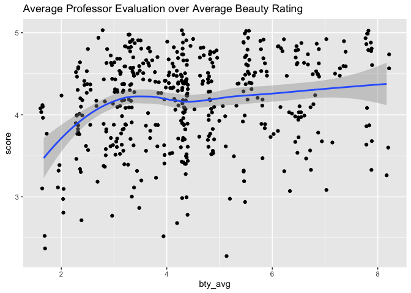

Lab 09 - Grading the professor, Pt. 1
================
Lindsey Wilson
4/24/23

### Load packages and data

``` r
library(tidyverse) 
library(tidymodels)
library(openintro)
```

``` r
evals <- evals
```

### Exercise 1

The distribution of `score` is visualized below:

``` r
ggplot(evals,
       aes(x = score)) + 
  geom_histogram(stat = "count",  fill = "Grey") +
  labs(title = "Professor Evaluation Scores",
       subtitle = "Average evaluation represented by solid black line") + 
  geom_vline(xintercept = mean(evals$score), color = "Black")
```

    ## Warning in geom_histogram(stat = "count", fill = "Grey"): Ignoring unknown
    ## parameters: `binwidth`, `bins`, and `pad`

<!-- --> It looks like we
have some pretty substantial negative skew, which is what I expected to
see. Students don’t really give negative course/professor evals unless
they had an extremely negative experience in the class.

### Exercise 2

Next let’s visualize the relationship between average evaluation score
and average beauty rating:

``` r
ggplot(evals,
       aes( x = bty_avg,
            y = score)) +
  geom_point() + 
  geom_smooth() +
  labs(title = "Average Professor Evaluation over Average Beauty Rating")
```

<!-- -->

``` r
cor(evals$bty_avg, evals$score)
```

    ## [1] 0.1871424

It looks like there’s a weak positive correlation between average beauty
rating and average professor evaluation. More attractive professors get
better ratings, but the effect isn’t huge.

### Exercise 3

Let’s replot the above data using `geom_jitter()` instead of
`geom_point()`:

``` r
ggplot(evals,
       aes( x = bty_avg,
            y = score)) +
  geom_jitter() + 
  geom_smooth() +
  labs(title = "Average Professor Evaluation over Average Beauty Rating")
```

<!-- -->

This is likely a better representation of the relationship between
beauty and professor evals, because it adds a bit of random variation
that wasn’t present with `geom_point()`. Individuals only had a certain
number of discrete options (1-5) to indicate their ratings of the
professor, so the averages of those ratings were constrained to only be
able to take on certain values. `geom_jitter()` fixes that problem by
adding randomness to the average points in the dataset. That’s why the
points don’t fall into neat rows and columns like they did in Exercise
2.

## 

For Exercise 12, relevel() function can be helpful!
